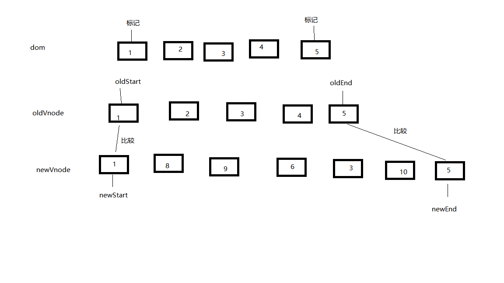

1.
不是响应式数据

在初次 defineproperty 过程中 data.dog 中没有 name 键值对所以没有给它在 vm 上和 data 中添加 get set 方法
而 this.dog.name 直接赋值不会触发 set 故不是响应式数据

成为响应式数据的写法

```javascript
  clickHandler () {
    // 该 name 属性是响应式的
    // dog 有 get set 方法，在dog赋值为一个对象时，会递归处理对象，给对象添加get set方法，这样就成为响应式数据了
    this.dog = {
      name : 'Trump'
    }
  }
```

原理：
通过递归 data 使用 defineproperty 给每个对象在 vm 和 data 中添加 get set 方法，
并对每一个数据添加一个 watch 处理函数并保存在 事件中心 dev 的 sub 中，
在 set 方法内部调用 dev 的 notify 方法
去 dev 的 sub 中寻找对应的 watch 函数并执行

当调用数据变动时会触发 set 方法，set 中会调用 notify 方法去 sub 中查找对应的 watch 函数并调用，watch 会对数据做相应的处理

2.diff 算法

diff 算法是通过查找差异来实现的

逐层比较差异，当同级节点相同时深入比较子节点，当不同时直接放弃比较，使用 newVnode

同级比较 oldVnode 和 newVnode

在 oldVnode 和 newVnode 中的头部和位置创建 start 和 end 指针

同类型头 ： oldStart= newStart 将两个 start 指针向后移动，dom 不变
同类型尾 : oldEnd = newEnd 将两个 end 指针向前移动，dom 不变


头尾 : oldStart = newEnd 将 oldStart 指针向后移动，将 newEnd 指针向前移动，将 oldDomItem 移动到 dom 中 oldEnd 之后，

尾头 : oldEnd = newStart 将 oldEnd 指针向前移动，将 newStart 指针向后移动，将 oldDomItem 移动到 dom 中 oldStart 之前，

新增节点：newStart 在 oldStart-oldEnd 中未找到，即为新增节点，将 newDomItem 插入到 oldStart 之前，将 newStart 指针向后移动

newStart 去 oldStart - oldEnd 中间找到了（跳过标记）将 newStart 指针向后移动，将 oldDom 标记，将 oldDomItem 移动到 dom 中 oldStart 之前，

最后会出现两种情况

1.  oldVnode 的 start 指针和 end 指针先相遇，这时 oldVnode 的 start 指针和 end 指针中间的 oldDomItem 是需要删除的内容，删除即可
2.  newVnode 的 start 指针和 end 指针先相遇，这时 newVnode 的 start 指针和 end 指针中间的 newDomItem 是需要新增的内容，将 newDomItem 插入到 dom 中 oldStart 之前
